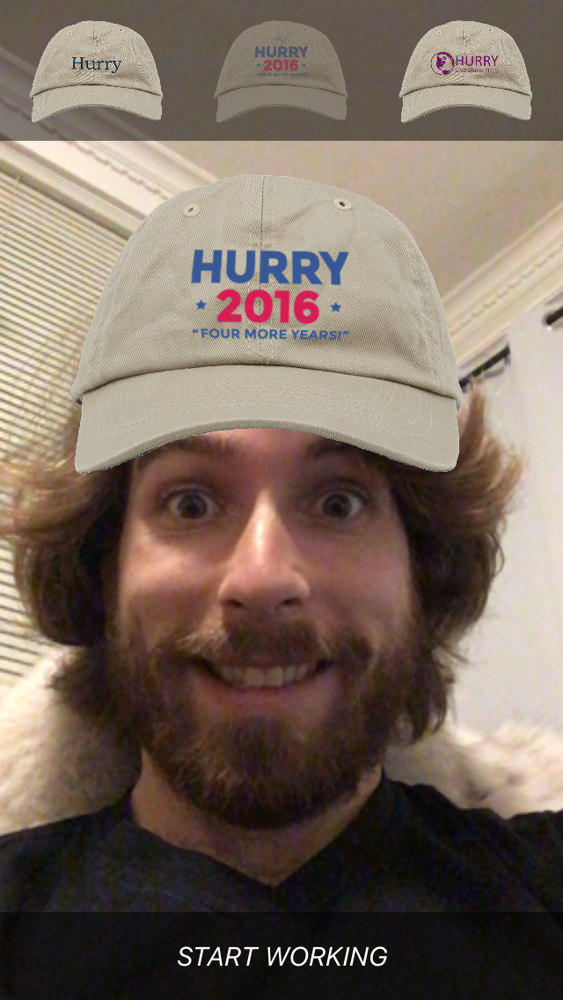

# Virtual Hats by Hurry

The app was made for the band Hurry:
- http://www.hurrymusic.com
- https://twitter.com/hurryband

You can virtually wear one of the hats sold at their live shows.

## Requirements

[CocoaPods](https://cocoapods.org/)

## Installation

```
pod install
```

## Dependencies

Face detection is handled by [Google's Mobile Vision](https://developers.google.com/vision/) SDK, based on this [sample](https://github.com/googlesamples/ios-vision).

For future reference, these articles may help when replacing Google's Mobile Vision with native Cocoa APIs:

- https://www.codeproject.com/Articles/1097378/In-Your-Face-Figuring-Out-Apple-s-Face-Detection-A
- https://stackoverflow.com/questions/34383917/face-detection-with-avfoundation-swift-2
- http://www.icapps.com/face-detection-with-core-image-on-live-video/#comment-4587

## Screenshots


